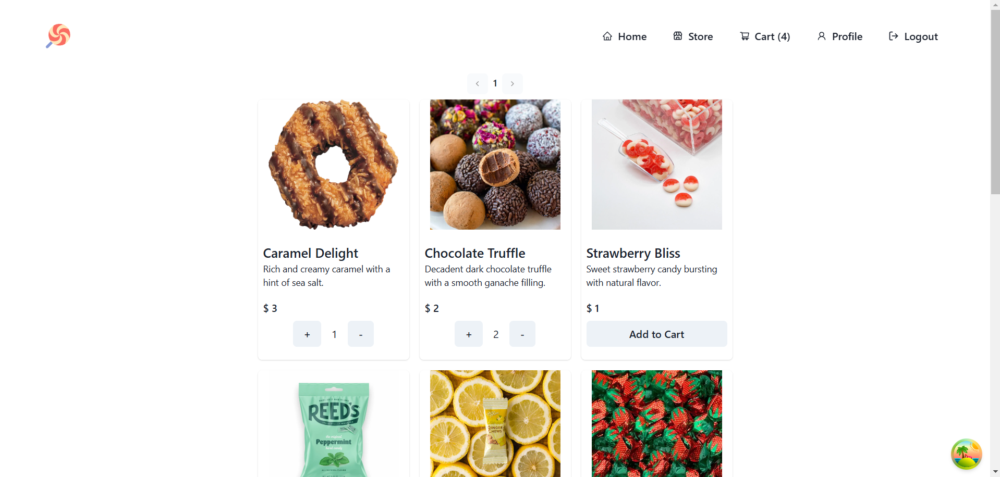
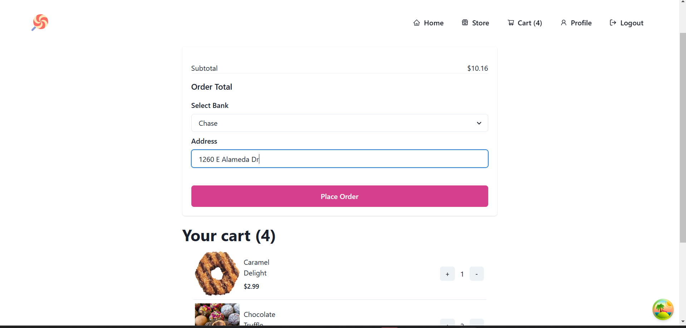

# CandyHouse E-commerce App

CandyHouse is a scalable and feature-rich e-commerce application designed for a seamless online candy shopping experience.

## Table of Contents

1. [Overview](#overview)
2. [Architecture](#architecture)
3. [Microservices](#microservices)
4. [Scalability](#scalability)
5. [Deployment and Orchestration](#deployment-and-orchestration)
6. [Project Structure](#project-structure)
7. [User Roles](#user-roles)
8. [Getting Started](#getting-started)
9. [License](#license)
10. [UI Gallery](#ui-gallery)

## Overview

CandyHouse provides a platform for users to browse and purchase candies. It supports three user roles: customer, vendor, and admin. Customers can place orders and cancel them, vendors can create and sell candies, and admins have comprehensive control over orders, and statistics with respect to sales and trends.

The system employs a microservices architecture in which the store UI, built with Next.js, communicates with dedicated services (order-service, product-service, and user-service) through configurable base URLs. Each service is containerized and interacts via RESTful APIs and Kafka-driven event updates, ensuring cohesive and scalable integration.

## Architecture

The microservices communicate via Kafka, ensuring efficient and real-time updates across the application. The MongoDB databases are separated for each microservice, maintaining data integrity.

*Diagram Description:*
- **Frontend:** Developed with Next.js, Chakra UI, and React Query, dockerized.
- **Microservices:** User, Product, and Order services, dockerized.
- **Databases:** MongoDB databases associated with each microservice.
- **Kafka:** Facilitates communication between microservices.
- **Kubernetes:** Deployed using Helm charts for orchestration, ensuring seamless scalability, load balancing, and service discovery.

## Microservices
Candyhouse adopts a microservices architecture, dividing the application into distinct, independent services that communicate through APIs. This approach promotes modularity, enabling independent development and deployment of each service.

- **User-Service:**
  - Handles authentication and user actions.
  - Provides JWT tokens for login and register.
  - Manages user roles and permissions.

- **Product-Service:**
  - Performs CRUD operations on candies.
  - Manages the quantity field associated with each product.
  - Uses separate MongoDB database.

- **Order-Service:**
  - Handles order creation, updates, and cancellations.
  - Processes quantity updates through Kafka communication.
  - Admins manage orders with various status updates.

## Scalability

CandyHouse is designed with scalability in mind. The microservices architecture allows for independent scaling of different components based on demand. Dockerization ensures easy deployment and management of services, making it suitable for handling increased traffic and growing user bases. The use of Kafka enables efficient communication between services, ensuring responsiveness and reliability in real-world scenarios.

## Deployment and Orchestration

CandyHouse leverages modern container orchestration via Kubernetes. Helm charts located in the 'candyhouse/charts' directory manage the deployment of microservices (order-service, product-service, and user-service) and the store UI, ensuring seamless scalability, high availability, and efficient resource management. This orchestration facilitates rolling updates, load balancing, and robust service discovery, enabling the frontend to reliably connect with domain-specific services.

## Project Structure

1. **store-ui:** The frontend of the application built with Next.js, Chakra UI, and React Query, dockerized for easy deployment.
2. **user-service:** Microservice responsible for authentication and user-related actions (login, register, token verification), dockerized.
3. **product-service:** Microservice performing CRUD operations on candies, dockerized.
4. **order-service:** Microservice associated with CRUD operations on orders and processing quantity updates, dockerized.

## User Roles

1. **User:** Customers who can place and cancel orders.
2. **Vendor:** Users who create and sell candies on the platform.
3. **Admin:** Users with CRUD capabilities on orders, managing orders as a whole.

## Getting Started

To run CandyHouse locally, follow these steps:

1. Clone the repository: `git clone https://github.com/yashyenugu/candyhouse.git`
2. Navigate to the project directory: `cd candyhouse`
3. Set up and run each microservice (refer to respective READMEs).
4. Start the frontend: `cd store-ui && yarn install && yarn dev`

## Technologies used

CandyHouse employs a variety of modern tools and technologies that underpin its architecture and facilitate robust, scalable development and deployment:

- **Frontend:** Next.js, Chakra UI, and React Query, providing a responsive and dynamic user interface.
- **Backend Microservices:** Node.js with TypeScript, Dockerized for isolated and scalable service deployment.
- **Database:** MongoDB, with dedicated databases for each microservice to maintain data integrity.
- **Communication:** Apache Kafka for efficient, real-time inter-service messaging.
- **Orchestration:** Kubernetes managed via Helm charts, enabling seamless scaling, load balancing, and high availability.
- **Code Quality & Testing:** ESLint, Prettier, Husky for pre-commit hooks, and Jest for testing.

## License

This project is licensed under the [MIT License](LICENSE). Feel free to use, modify, and distribute the code for your own projects.

## UI Gallery

Below is a gallery of screenshots demonstrating the UI of CandyHouse:

### Home Page

### Store

### Cart

### Candy Creation

### Vendor Dashboard

### Admin Order Table
