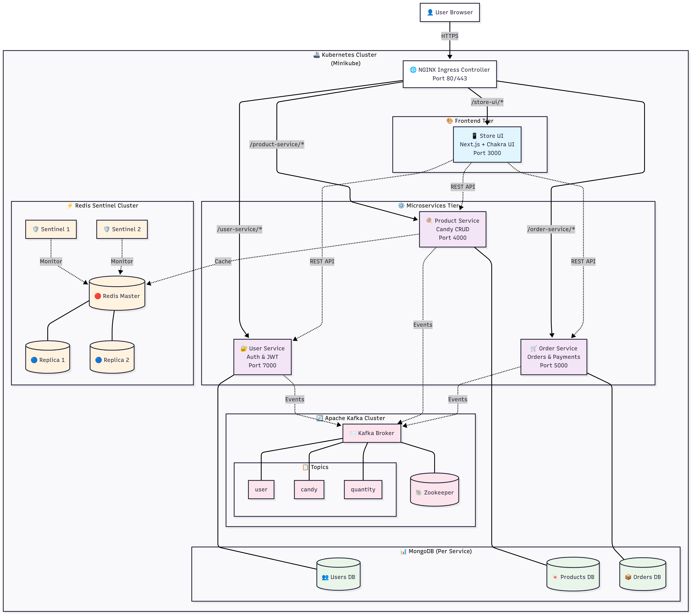
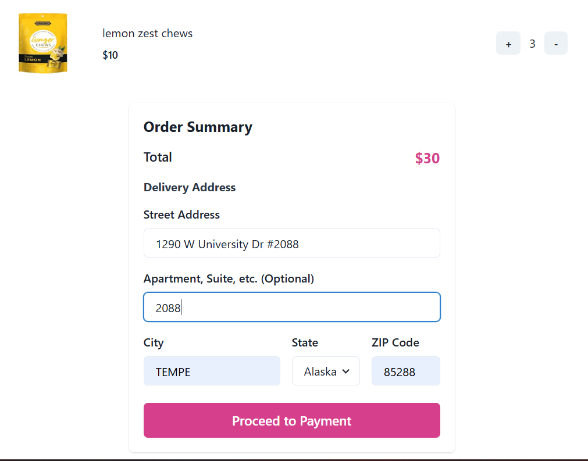
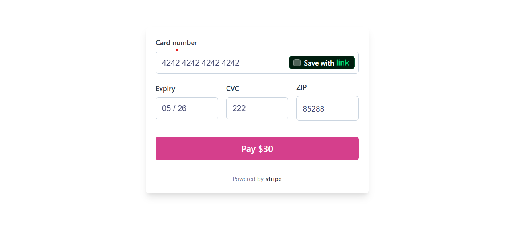
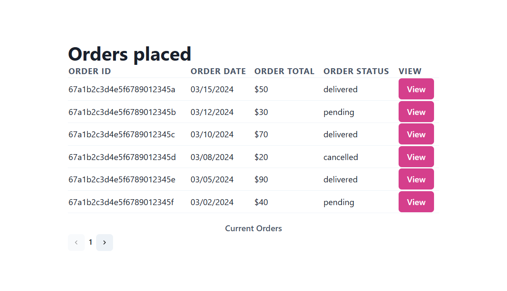

# 🍭 CandyHouse - Microservices E-Commerce Platform

> **An e-commerce application built with microservices architecture, event-driven design, and cloud-native deployment patterns.**

[](#-system-architecture)
[](#-deployment-with-minikube)
[](https://www.typescriptlang.org/)
[](LICENSE)

**CandyHouse** is an e-commerce platform built using microservices patterns. The project demonstrates system design concepts including event-driven architecture, distributed caching, inventory management, and containerized deployment.

## 🏗️ System Architecture



*Microservices architecture with event-driven communication via Kafka, Redis caching, and Kubernetes orchestration*

### 🚢 Kubernetes Cluster Overview


*Kubernetes deployment with pod orchestration, ingress routing, and auto-scaling configuration*

### 🎯 Architecture Components

**Core Patterns:**
- **🔄 Event-Driven Architecture**: Asynchronous communication via Apache Kafka
- **🏛️ Database Per Service**: Data isolation with MongoDB per microservice  
- **⚡ Redis Sentinel Caching**: Distributed caching with cache-aside pattern
- **🔐 Stateless Authentication**: JWT-based security across services
- **📈 Horizontal Auto-Scaling**: Kubernetes HPA configuration (1-5 replicas per service)
- **🎭 Multi-Tenant Design**: Separate workflows for vendors, customers, and admins

**Application Features:**
- **👥 Customer Flow**: Product browsing → Cart management → Checkout → Order tracking
- **🏪 Vendor Tools**: Product catalog management → Inventory tracking → Sales analytics  
- **👨‍💼 Admin Interface**: Order management → User administration → System monitoring

**Technical Integration:**
- **Inventory Management**: Kafka events maintain inventory consistency across services
- **Payment Processing**: Stripe webhook integration with transaction handling
- **Image Management**: Cloudinary integration for product images
- **Health Monitoring**: Health checks, structured logging, and metrics endpoints

### 🛠️ Technology Stack & Architecture Components

| Layer | Technology | Purpose & Implementation |
|-------|------------|--------------------------|
| **🎨 Frontend** | Next.js + Chakra UI + React Query | Server-side rendering, responsive design, UI state management |
| **🌐 API Gateway** | NGINX Ingress Controller | Load balancing, SSL termination, service routing |
| **⚙️ Microservices** | Node.js + TypeScript + Express | Business logic, RESTful APIs, health checks |
| **📡 Message Broker** | Apache Kafka + Zookeeper | Event streaming, service decoupling, message delivery |
| **💾 Caching** | Redis Sentinel (Master + 2 Replicas) | Cache-aside pattern, automatic failover, session storage |
| **🗄️ Databases** | MongoDB (per service) | Document storage, service data isolation |
| **🚢 Orchestration** | Kubernetes + Helm Charts | Container orchestration, auto-scaling, deployments |
| **💳 Payments** | Stripe API + Webhooks | Payment processing, transaction handling |
| **🖼️ Media** | Cloudinary | Image optimization, CDN delivery |

### 📊 Event-Driven Communication Flow

**Event-Driven Data Flow (via Apache Kafka):**
- **👤 User Lifecycle Events**: Registration, profile updates → synced to Product & Order services
- **🍬 Product Catalog Events**: Create/update products → synced to Order service for validation  
- **📦 Inventory Management Events**: Stock updates, reservations → real-time inventory consistency

## 🎨 Application Screenshots

**User interface built with Next.js and Chakra UI**

### 👥 Customer Journey
| **🏠 Landing Page** | **🛍️ Product Catalog** |
|:---:|:---:|
|  |  |

| **🛒 Shopping Cart & Checkout** | **💳 Secure Payment Processing** |
|:---:|:---:|
|  |  |

| **📊 Order Management** |
|:---:|
|  |

### 🏪 Vendor & Admin Features
| **📈 Vendor Dashboard** | **🍭 Product Creation** |
|:---:|:---:|
|  |  |

## 🚀 Deployment with Minikube

**Run the microservices architecture locally with Kubernetes**

### 🔧 Prerequisites & Setup
```bash
# Install required tools (macOS)
brew install minikube kubectl helm

# Install required tools (Windows)
choco install minikube kubernetes-cli kubernetes-helm

# Start minikube cluster with adequate resources
minikube start --memory=8192 --cpus=4 --disk-size=20g

# Enable required addons
minikube addons enable ingress
minikube addons enable metrics-server
```

### 🚀 One-Command Deployment
```bash
# Clone and deploy
git clone https://github.com/yashyenugu/candyhouse.git
cd candyhouse

# Configure secrets (MongoDB URIs, API keys, JWT secrets)
cp secrets.example.yaml secrets.yaml
# Edit secrets.yaml with your configuration

# Deploy entire platform with Helm
helm install candyhouse ./helm-chart -f secrets.yaml

# Monitor deployment
kubectl get pods -w
```

### 🌐 Access the Platform
```bash
# Get minikube IP and configure local access
minikube ip
echo "$(minikube ip) candyhouse.com" | sudo tee -a /etc/hosts

# Access the application
open http://candyhouse.com
```

### 🔍 Monitor the System
```bash
# View Kafka events
kubectl port-forward svc/candyhouse-kafka-ui 8080:8080
open http://localhost:8080

# View service logs
kubectl logs -f deployment/candyhouse-store-ui
kubectl logs -f deployment/candyhouse-order-service
kubectl logs -f deployment/candyhouse-product-service

# Check auto-scaling status
kubectl get hpa

# Monitor Redis cluster
kubectl get pods -l app=redis
```

## 🔧 Technical Implementation Details

### 🎯 Architecture Patterns

**🔄 Event-Driven Communication:**
- Apache Kafka handles asynchronous message passing between microservices
- Services publish events for user registration, product updates, and inventory changes
- Event consumers maintain eventual consistency across service boundaries

**⚡ Distributed Caching:**
- Redis Sentinel configuration with master-slave replication
- Two sentinel nodes provide automatic failover capabilities
- Cache-aside pattern implemented for product catalog queries
- TTL-based expiration for session data and temporary storage

**📊 Data Management:**
- Each microservice maintains its own MongoDB database
- Service-specific data models prevent cross-service dependencies
- Database connections pooled and configured per service requirements

### 🛠️ Infrastructure Configuration

**🚢 Container Orchestration:**
- Kubernetes deployment manifests define service specifications
- Helm charts provide templated configuration management
- Horizontal Pod Autoscaler configured for CPU and memory thresholds
- Resource requests and limits defined for each service container
- ConfigMaps and Secrets manage environment-specific configuration

## 🔧 Local Development

**Two development options: Lightweight Docker setup or Full Kubernetes simulation**

### 🚀 Option 1: Lightweight Development (Recommended)

**Fast development setup with minimal resource usage (1-2GB RAM)**

#### 📦 Start Infrastructure Services
```bash
# Start MongoDB, Redis, Kafka, and admin UIs
docker-compose -f development/docker-compose.dev.yml up -d

# Verify services are running
docker-compose -f development/docker-compose.dev.yml ps
```

#### 🛠️ Run Microservices Natively
```bash
# Terminal 1: User Service
cd user-service && npm install && npm run dev      # Port 7000

# Terminal 2: Product Service  
cd product-service && npm install && npm run dev   # Port 4000

# Terminal 3: Order Service
cd order-service && npm install && npm run dev     # Port 5000

# Terminal 4: Frontend
cd store-ui && npm install && npm run dev          # Port 3000
```

#### 🌐 Access Application
- **🍭 CandyHouse App**: http://localhost:3000

#### ⚙️ Environment Configuration
Create env files in each service directory:

**store-ui/.env**
```bash
# Global Environment Settings
NODE_ENV=development
PORT=3000

# Backend Microservices Base URLs (for local development)
USER_SERVICE_BASE_URL=http://localhost:7000
PRODUCT_SERVICE_BASE_URL=http://localhost:4000
ORDER_SERVICE_BASE_URL=http://localhost:5000

# Cloudinary Configuration (for image uploads)
CLOUDINARY_CLOUD_NAME=your-cloudinary-cloud-name
CLOUDINARY_API_KEY=your-cloudinary-api-key
CLOUDINARY_API_SECRET=your-cloudinary-api-secret
CLOUDINARY_FOLDER_NAME=candyhouse

# Stripe Configuration (for payments)
NEXT_PUBLIC_STRIPE_PUBLISHABLE_KEY=pk_test_your_stripe_publishable_key_here
```

**user-service/.env.development.local**
```bash
NODE_ENV=development
PORT=7000
MONGO_URI=mongodb://localhost:27017/candyhouse-users
JWT_SECRET=dev-jwt-secret-not-for-production-min-32-chars
JWT_EXPIRES_IN=24
KAFKA_URL=localhost:9092
```

**product-service/.env.development.local**
```bash
NODE_ENV=development
MONGO_URI=mongodb://localhost:27017/candyhouse-products
KAFKA_URL=localhost:9092
REDIS_HOST=localhost
REDIS_PORT=6379
REDIS_PASSWORD=dev-redis-password
REDIS_USE_SENTINEL=false
CLOUDINARY_CLOUD_NAME=your-cloudinary-cloud-name
CLOUDINARY_API_KEY=your-cloudinary-api-key
CLOUDINARY_API_SECRET=your-cloudinary-api-secret
```

**order-service/.env.development.local**
```bash
NODE_ENV=development
MONGO_URI=mongodb://localhost:27017/candyhouse-orders
KAFKA_URL=localhost:9092
STRIPE_SECRET_KEY=sk_test_your_stripe_secret_key_here
```

#### 🔧 External Services Setup
Before running the application, you'll need to set up these external services:

**🎨 Cloudinary (Image Management)**:
1. Create account at [https://cloudinary.com](https://cloudinary.com)
2. Get credentials from [https://cloudinary.com/console](https://cloudinary.com/console)
3. Update `CLOUDINARY_*` variables in your `.env.development.local` files

**💳 Stripe (Payment Processing)**:
1. Create account at [https://stripe.com](https://stripe.com)
2. Get API keys from [https://dashboard.stripe.com/apikeys](https://dashboard.stripe.com/apikeys)
3. Use **Publishable Key** (`pk_test_...`) for `NEXT_PUBLIC_STRIPE_PUBLISHABLE_KEY`
4. Use **Secret Key** (`sk_test_...`) for `STRIPE_SECRET_KEY`

#### 🛑 Stop Development Environment
```bash
# Stop all infrastructure services
docker-compose -f development/docker-compose.dev.yml down

# Remove volumes (optional - clears all data)
docker-compose -f development/docker-compose.dev.yml down -v
```

### 🚢 Option 2: Full Kubernetes Simulation

**Full Kubernetes deployment with auto-scaling (6-8GB RAM)**

Follow the [Deployment with Minikube](#-deployment-with-minikube) section above for the complete Kubernetes setup with Helm charts.

### 🧪 Testing & Quality
```bash
# Run tests across all services
npm run test                 # Unit tests
npm run test:integration     # Integration tests
npm run test:e2e            # End-to-end tests

# Code quality checks
npm run lint                # ESLint
npm run format             # Prettier
npm run type-check         # TypeScript
```

### 📡 API Documentation
- **User Service**: `http://localhost:7000/docs` - Authentication & user management
- **Product Service**: `http://localhost:4000/docs` - Product catalog & inventory
- **Order Service**: `http://localhost:5000/docs` - Order processing & payments


---

## 📄 License

This project is licensed under the [MIT License](LICENSE) - feel free to use it for learning, portfolio purposes, or as a foundation for your own projects.

---

<div align="center">
  
**🍭 A microservices e-commerce platform implementation**

*Demonstrating patterns for scalable, maintainable applications*

[](https://github.com/yashyenugu)
[](https://linkedin.com/in/yashyenugu)

</div>